# MultiCloud Management - App Management and Sample apps

This document explains about MCM application management and its resources.

Also it cotains sample application deployment scripts for the Channel types NameSpace, Helm and Git Repository.

The content is maded based on the Multicloud Management Version 1.3.x

## Overview

MCM provides lightweight application management capabilities through custom resource definitions in Kubernetes.

The custom resources are 
- Channel
- Deployable
- Application
- PlacementRule
- Subscription

Using this resources you can define your application and install it in MCM Hub clusters. Based on the placment rules, it will be propagated to appropriate managed cluster. Anytime, if you want to move your applicaitons from one managed cluster to another managed cluster can be done very easily by just changing the placement rule.

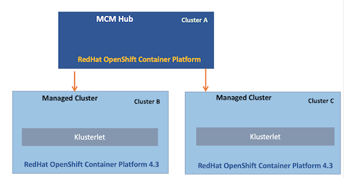

## Application Resources

### 1. Channel

Channel points to a physical place where resources are stored for deployment.

There are 4 different channel types available.

- Kubernetes namespace 
- Helm repository
- GitHub repository
- Object store

### 2. Deployable

Kubernetes resources that contain templates to wrap other Kubernetes resources or to represent Helm releases for deployment to clusters.

### 3. Placement Rule

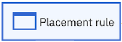

Define the target clusters where deployables can be deployed

### 4. Subscriptions

Sets of definitions that identify deployables within channels by using annotations, labels, and versions.
Subscription operator can monitor the channel for new or updated deployables.
Then, the operator can download the deployables  directly from the source location (Helm repository, GitHub epository, object store, or namespace) to the target managed clusters

### 5. Application

For grouping application components such as channel, subscription, placement rule and deployables.

-------------

## Application resource interactions and lifecycle

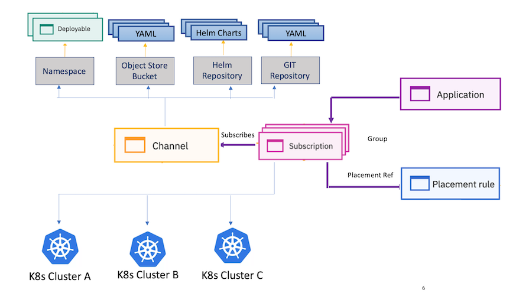

1. Users creates the YAML definitions for channels
2. Application developers 
   - Creates the YAML definitions for required applications
   - Store them in channels (Namespace, HelmRepo, GitHub and objectBucket)
3. Users creates placement rules. 
4. Application developers creates Applications resource for grouping all the components
5. Users creates Subscription.
   - Subscription associates the Deployables from Channel with Placement rules.
   - Subscription deploys the Deployables in the appropriate cluster.

-------------

## Application Resources – Subscription Propagation

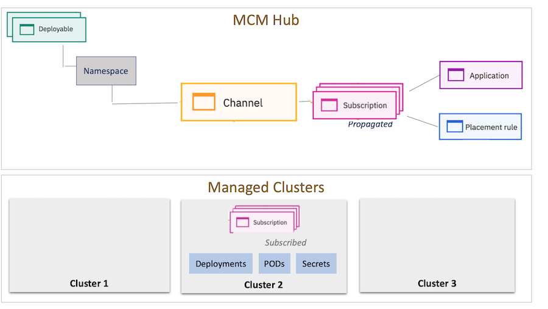

- Based on the Placement Rule the Subscription is propagated to Cluster 2.
- Propagated Subscription from cluster 2, pull the Deployments, PODS and Secrets from the Channel and  deploy in the cluster 2

-------------

## Sample Yaml files

### 1. Channel

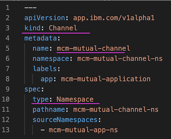

### 2. Deployable

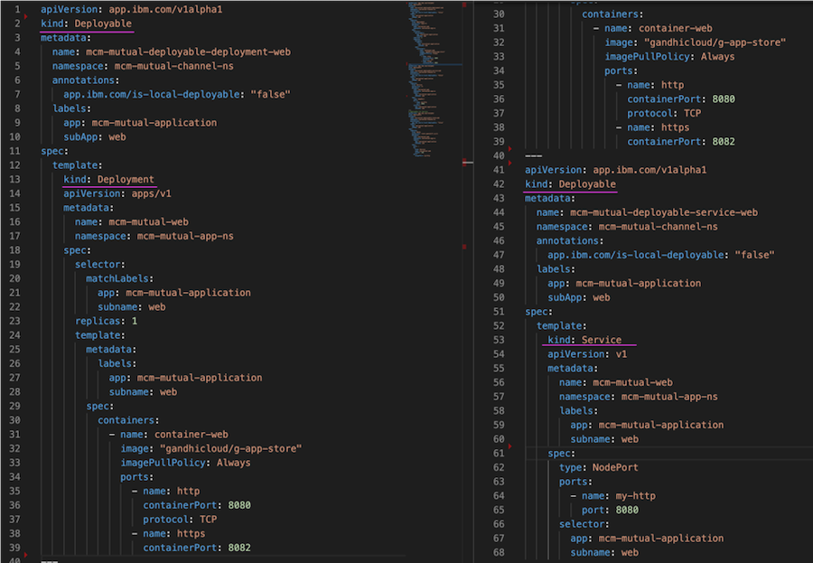

### 3. Placement Rule

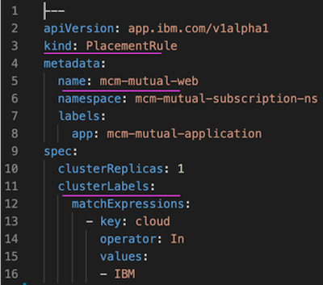

### 4. Subscriptions

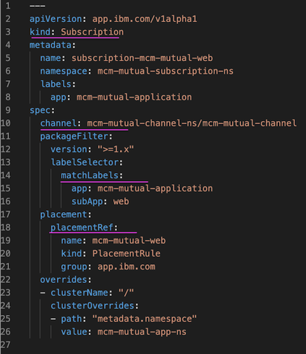

### 5. Application

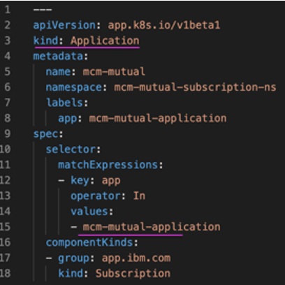

Here is how these files are linked.

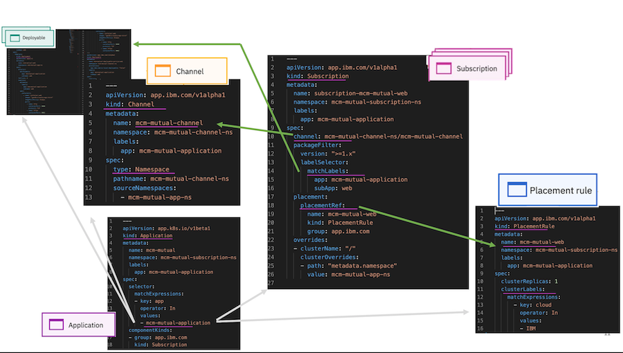

-------------

## Other Deployment Models

### Deploy by using channels, subscriptions, and placement rules

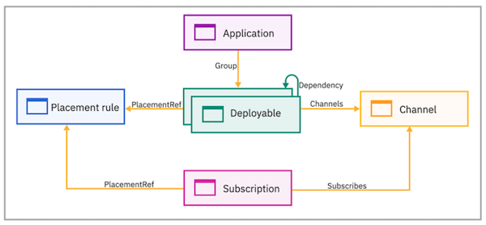

### Deploy by using only placement rules

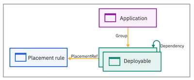

### Deployable can include a placement rule

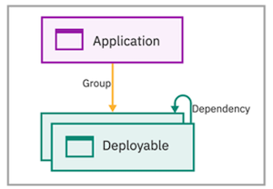

-------------

## App toplogy

Once the app is deployed in MCM, here is how the App toplogy looks like at MCM Hub.

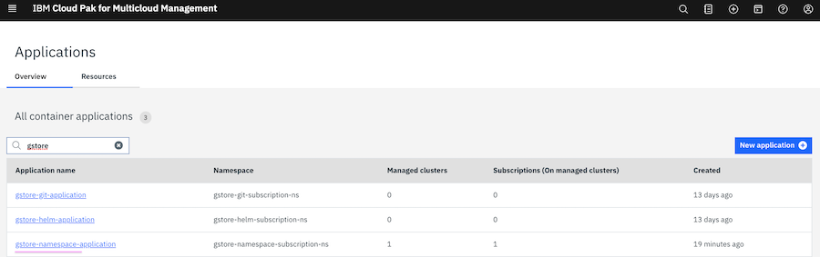
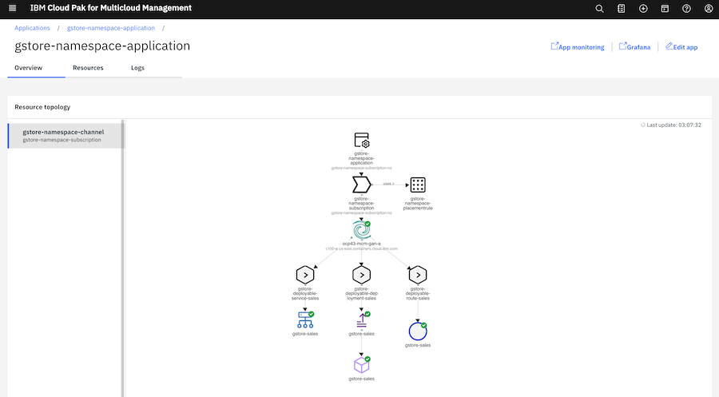

-------------

## Sample scripts for different Channel Types

### Channel Type : Namespace
https://github.com/GandhiCloudLab/mcm-namespace-sample

### Channel Type : GIT

https://github.com/GandhiCloudLab/mcm-git-sample

### Channel Type : HELM
https://github.com/GandhiCloudLab/mcm-helm-sample

-------------